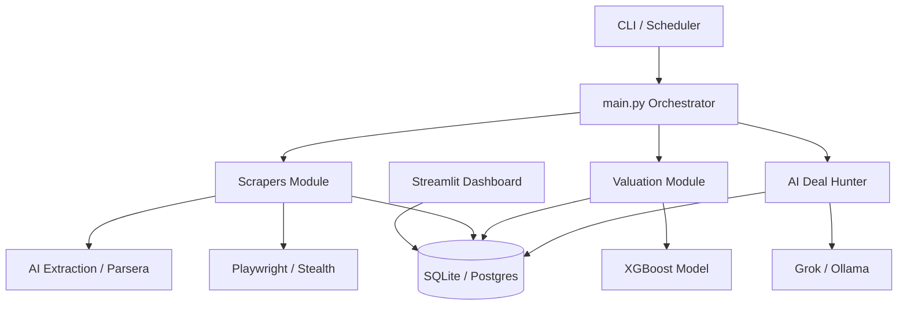

# System Architecture - AutoDeal IA Hunter

The project follows a modular, layered architecture designed for stability, scalability, and AI-first processing.

## High-Level Architecture

## Core Layers

### 1. Presentation Layer
- **CLI (`main.py`):** Primary interaction point for running tasks (scrape, train, valuate, find-deals).
- **Dashboard (`dashboard/app.py`):** Streamlit interface for visualizing deals and system health.

### 2. Orchestration Layer
- **`main.py`:** Handles CLI parsing, environment validation, and routing to specific services.
- **`scheduler/`:** Manages periodic execution of scraping and valuation jobs.

### 3. Business Logic Layer
- **Scapers (`scrapers/`):** Async scrapers for multiple sources with hybrid local/AI extraction.
- **Valuation (`valuation/`):** ML-based price prediction using XGBoost.
- **AI Agent (`ai_agent/`):** High-level deal scoring and verification using LLMs.

### 4. Data Layer
- **Database (`database/`):** SQLAlchemy ORM with support for SQLite and PostgreSQL.
- **Models (`database/models.py`):** Normalized schema for Vehicles, Price History, Scraping Logs, and Watchlists.

### 5. Utilities & Infrastructure
- **Validation:** Pydantic-based validation for all data boundaries.
- **Production Safeguards:** Signal handlers, environment checks, and log rotation.
- **Communication:** Discord/Telegram alerts and Sentry error tracking.

## Technical Patterns
- **Hybrid Scraping:** Combines traditional CSS-based scraping with LLM-powered extraction for resilience.
- **Scraping Lifecycle:** Scrape -> Validate -> Save -> Valuate -> Score -> Alert.
- **Idempotency:** URL-based hashing for listing identification and deduplication.
- **Circuit Breaker:** Resilience pattern implemented for external API calls and scrapers.
